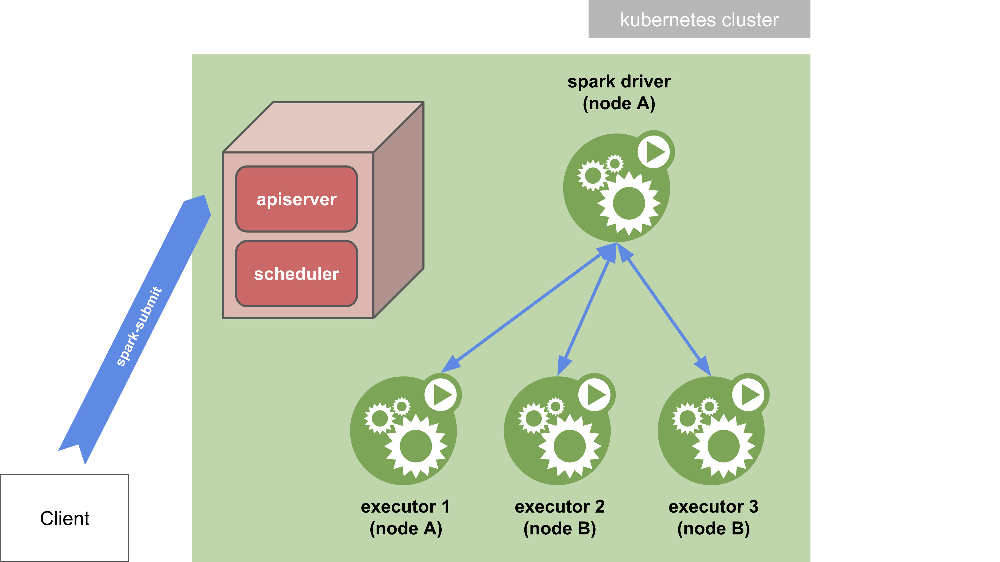

# Spark-submit in cluster mode

In _cluster mode_, your application is submitted from a machine far from the worker machines (e.g. locally on your 
laptop). You need a Spark distribution installed on this machine to be able to actually run the `spark-submit` script. 
In this mode, the script exits normally as soon as the application has been submitted. The driver is then detached and 
can run on its own in the kubernetes cluster. You can print the logs of the driver pod with the `kubectl logs` command 
to see the output of the application.



It is possible to use the authenticating `kubectl` proxy to communicate to the Kubernetes API.

The local proxy can be started by:

```bash
kubectl proxy &
```
If the local proxy is running at localhost:8001, the remote Kubernetes cluster can be reached by `spark-submit` by 
specifying `--master k8s://http://127.0.0.1:8001` as an argument to `spark-submit`.

# Spark-submit in client mode

In _client mode_, the `spark-submit` command is directly passed with its arguments to the Spark container in the driver 
pod. With the `deploy-mode` option set to `client`, the driver is launched directly within the `spark-submit` process 
which acts as a client to the cluster. The input and output of the application are attached to the logs from the pod.


# Who Does What?

With "native" Spark, we will execute Spark applications in client mode, so as not to depend on a local Spark 
distribution. Specifically, the user creates a driver pod resource with `kubectl`, and the driver pod will 
then run `spark-submit` in client mode internally to run the driver program.
 
With Spark Operator, a `SparkApplication` should set `.spec.deployMode` to `cluster`, as `client` is not currently
 implemented. Behind the scenes, the behavior is exactly the same as with native Spark: the operator's controller 
thus embeds a Spark distribution which plays the role of Spark scheduler; driver pods are spawned from the 
controller... and then run `spark-submit` in client mode internally to run the driver program. But this is globally 
transparent for the end user.
  

 
Additional details of how `SparkApplications` are run can be found in the 
[design documentation](https://github.com/GoogleCloudPlatform/spark-on-k8s-operator/blob/master/docs/design.md#architecture).


